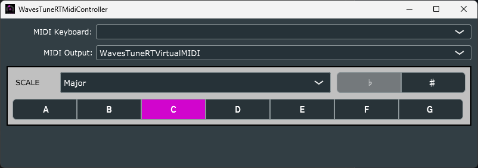

# WavesTuneRTMidiController
This application was created to simultaniously control the `Scale Root` and `Scale Type` parameters of multiple instances of the "Waves Tune Real-Time" plugin within [Studio One 6](https://www.presonus.com/products/Studio-One/new-in-studio-one-6). The plugins can be controlled using the user interface as well as an external MIDI keyboard. Even though Studio One was the DAW targetted when making this application, it could still work with other DAWs that support plugin parameter control via MIDI.

Studio One 6 has the following limitations that necessitated the need for this application:
1. No support for grouping multiple plugin parameters together across tracks such that they can all be controlled together.
1. Cannot globally connect multiple plugin parameters to the same MIDI control such that changing the MIDI control changes all of the parameters associated with it.
1. Cannot use MIDI notes to update plugin parameters.

This application's UI mirrors the `Scale` section of "Waves Tune Real-Time" (v14) plugin and allows you to control up 6 instances of the plugin by outputing 6 copies of the MIDI control value for both the `Scale Root` and `Scale Type` that is selected. These MIDI controls can then be assigned to the `Scale Root` and `Scale Type` parameters of the various plugin instances within Studio One.

Additionally, you can select a MIDI keyboard and use the keyboard notes to control the `Scale Root` value. Pressing a note on the MIDI keyboard will set the `Scale Root` to corresponding value for the note played regardless of octive. You cannot control the `Scale Type` value with the MIDI keyboard.

## Virtual MIDI Output Device
This program creates a virtual MIDI device to allow direct communication with a DAW running on the same machine. To use this virtual MIDI device, `WavesTuneRTVirtualMIDI` must be selected as the MIDI Output. If running on Windows, the [teVirtualMIDI](https://www.tobias-erichsen.de/software/virtualmidi.html) driver must also be installed prior to running the application. You can install the driver by downloading and installing either [rtpMIDI](https://www.tobias-erichsen.de/software/rtpmidi.html) or [loopMIDI](https://www.tobias-erichsen.de/software/loopmidi.html) from the developer's website.
